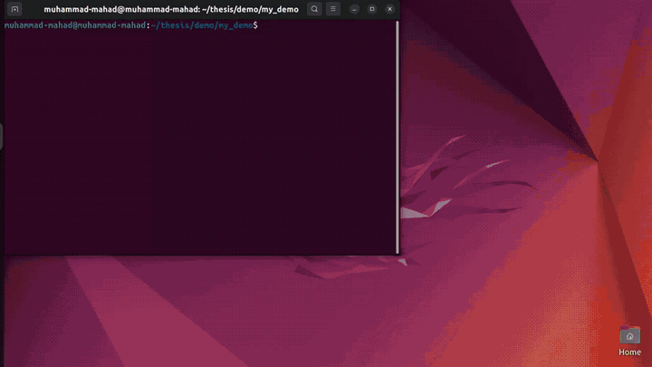

# Safe Dual-Arm Cable Routing with Deformable Linear Objects

### M.Sc. Thesis Simulation — Robotics & AI, NUST

[](https://muhammad-mahad.github.io/dual-arm-dlo-collision-avoidance/)
[](https://www.python.org/)
[](https://github.com/google-deepmind/mujoco)
[](https://github.com/kevinzakka/mink)
[](LICENSE)

> **Thesis title:** Safe Dual-Arm Cable Routing with Deformable Linear Objects: Hierarchical Planning and Contact-Aware Control Barrier Functions

---

## Demo



> Two Franka Emika Panda arms performing autonomous pick-up, contact-aware  
> handover, and smooth millimeter-scale placement in MuJoCo.


<video src="media/demo.mp4" controls="controls" muted="muted" width="100%"></video>

---

## Overview

This repository contains the simulation foundation for my M.Sc. thesis on a **hierarchical collision-avoidance framework for dual-arm cable routing**.

The current codebase implements a complete rigid-body **Month 1 Baseline**:

- ✅ Autonomous pick-up from table (right arm, top-down grasp)
- ✅ Contact-aware handover using distance-threshold sensing
- ✅ Smooth, millimeter-scale trajectory interpolation (no joint trajectory pre-computation)
- ✅ Continuous task-space control via **mink differential IK**
- ✅ Freeze-and-freeze gripper isolation to prevent grip loss

The thesis roadmap extends this testbed to **deformable cable manipulation**, utilizing a **global planner (JIT/DIT) for coarse pathing** and a local controller featuring **MPC wrapped in a Control Barrier Function (CBF)**.

---

## Thesis Context

This simulation is developed as part of my M.Sc. thesis in **Robotics and AI** at  
the National University of Sciences and Technology (NUST), Pakistan, under the  
supervision of [Dr. Karam Dad Kallu](https://smme.nust.edu.pk/faculty/karam-dad-1/).

The primary objective is to design a hierarchical collision-avoidance framework for dual-arm cable routing in simulation, handling three distinct safety aspects simultaneously:

1. **Arm–arm self-collision**
2. **Arm/cable–environment collision**
3. **Contact-aware fixture interaction** (distinguishing desired clip insertions from unintended collisions)

📄 [Read the full thesis proposal](docs/thesis_proposal.md)

---

## Technology Stack

| Component | Choice |
|---|---|
| Physics Simulator | MuJoCo 3.x (*direct Python/C++ API; bypassing ROS for Phase 1*) |
| Robot Model | Dual Franka Emika Panda (*vikashplus/frankasim*) |
| Kinematics / IK Solver | Pinocchio / [mink](https://github.com/kevinzakka/mink) |
| Cable Physics Model | Adapted Discrete Elastic Rods ([qj25/adapteddlomuj](https://github.com/qj25/adapteddlomuj)) |
| Local Control / Safety | MPC + Control Barrier Functions (CBF-QP) via OSQP / qpOASES |
| Global Planner | Direction Informed Trees (DIT*) / Just-in-Time (JIT) |
| Language | Python 3.10+ / C++ |

---

## Installation

### Prerequisites

- Python 3.10+
- Git

---

### Option 1 — Automated Setup (Recommended)

Clone the repository and run the setup script for your platform. It will automatically create the virtual environment and install all dependencies from `requirements.txt`.

**Linux / macOS**

```bash
git clone https://github.com/muhammad-mahad/dual-arm-dlo-collision-avoidance.git
cd dual-arm-dlo-collision-avoidance
chmod +x setup_env.sh
./setup_env.sh
```

**Windows**

```bat
git clone https://github.com/muhammad-mahad/dual-arm-dlo-collision-avoidance.git
cd dual-arm-dlo-collision-avoidance
setup_env.bat
```

---

### Option 2 — Manual Setup

```bash
# 1. Clone the repository
git clone https://github.com/muhammad-mahad/dual-arm-dlo-collision-avoidance.git
cd dual-arm-dlo-collision-avoidance

# 2. Create and activate virtual environment
python -m venv venv

# Linux / macOS
source venv/bin/activate

# Windows
venv\Scripts\activate.bat

# 3. Upgrade pip
pip install --upgrade pip

# 4. Install dependencies
pip install -r requirements.txt
```

---

### Verify Installation

After either option, confirm everything is working:

```bash
python -c "import mujoco; import mink; from loop_rate_limiters import RateLimiter; import numpy; print('All imports OK')"
```

---

### Run the Demo

```bash
cd simulation
python demo_pick_cube.py
```

A MuJoCo viewer window will open and the 18-phase dual-arm pick-handover-place sequence will begin automatically.

---

## Demo Phases

| Phase | Description |
|---|---|
| P0–P2 | Right arm approaches and grasps cube (top-down orientation) |
| P3 | Right gripper closes — firm grasp established |
| P4–P5 | Right arm lifts cube, wrist reorients to side-grip, moves to handover position |
| P6–P8 | Left arm approaches with contact sensing (distance threshold: 10 mm) |
| P9–P10 | Synchronized clamping — both grippers close, right gripper opens (handover complete) |
| P11a–P11b | Left arm moves sideways at constant height, then lifts (prevents inertial slip) |
| P12 | Right arm retreats — left arm fully frozen at current joint state |
| P13–P15 | Left carry via smooth 1 mm waypoint interpolation to table center |
| P16–P17 | Cube settles on table, left gripper opens |
| P18 | Left arm retreats |

---

## Project Timeline (6 Months)

See [ROADMAP.md](ROADMAP.md) for detailed task tracking based on the thesis proposal.

| Timeline | Status | Objective & Description |
|---|---|---|
| **Month 1** | ✅ In Progress | **Simulation Setup & Minimal Interface**: Construct MuJoCo dual-arm environment (direct API) and calibrate DER cable model. *(Rigid-body baseline completed)* |
| **Month 2** | 🔲 Planned | **Local Control & Baseline Safety**: Develop MPC tracking controller & implement core CBF constraints ($h_{arm-arm} \ge 0$, $h_{arm-env} \ge 0$, $h_{cable-env} \ge 0$, tension limits). |
| **Month 3** | 🔲 Planned | **Global Planner Integration**: Adapt DIT/JIT algorithms for DLOs using a catenary-aware cost function. |
| **Month 4** | 🔲 Planned | **Contact-Aware Mode Switching**: Implement force-simulated CEI to temporarily relax constraints for clip insertions. |
| **Month 5** | 🔲 Planned | **Dynamic Stress Testing & Evaluation**: Execute fast motions/dynamic obstacle avoidance, benchmarking against standard MPC and vanilla RRT. |
| **Month 6** | 🔲 Planned | **Thesis Writing**: Data analysis, final manuscript drafting, and defense formatting. |

---

## References

1. **Yin, H., Varava, A., & Kragic, D. (2021).** "Modeling, learning, perception, and control methods for deformable object manipulation." *Science Robotics*, 6(54).
2. **Zhu, J., et al. (2019).** "Robotic manipulation planning for shaping deformable linear objects with environmental contacts." *IEEE Robotics and Automation Letters*.
3. **Yu, M., et al. (2023).** "A coarse-to-fine framework for dual-arm manipulation of deformable linear objects with whole-body obstacle avoidance." *2023 IEEE International Conference on Robotics and Automation (ICRA)*.
4. **Chen, K., Bing, Z., et al. (2023).** "Contact-aware Shaping and Maintenance of Deformable Linear Objects With Fixtures." *IROS*.
5. **Chen, K., et al. (2024).** "Real-time Contact State Estimation in Shape Control of Deformable Linear Objects under Small Environmental Constraints." *ICRA*.
6. **Zhang, L., et al. (2025).** "Direction Informed Trees (DIT*): Optimal Path Planning via Direction Filter and Direction Cost Heuristic." *arXiv preprint* arXiv:2508.19168.
7. **Cai, K., Zhang, L., et al. (2026).** "Just in time Informed Trees: Manipulability-Aware Asymptotically Optimized Motion Planning." *arXiv preprint* arXiv:2601.19972.
8. **Zeng, Q., et al. (2023).** "Accurate Simulation and Parameter Identification of Deformable Linear Objects in MuJoCo." *arXiv preprint* arXiv:2310.00911.

---

## License

This project is licensed under the MIT License — see [LICENSE](LICENSE) for details.

---

## Contact

**Muhammad Mahad**  
M.Sc. Candidate, Robotics & AI — NUST, Pakistan  
[LinkedIn](https://www.linkedin.com/in/muhammad-mahad/) | [Email](mailto:mmahad.rime24smme@student.nust.edu.pk)
